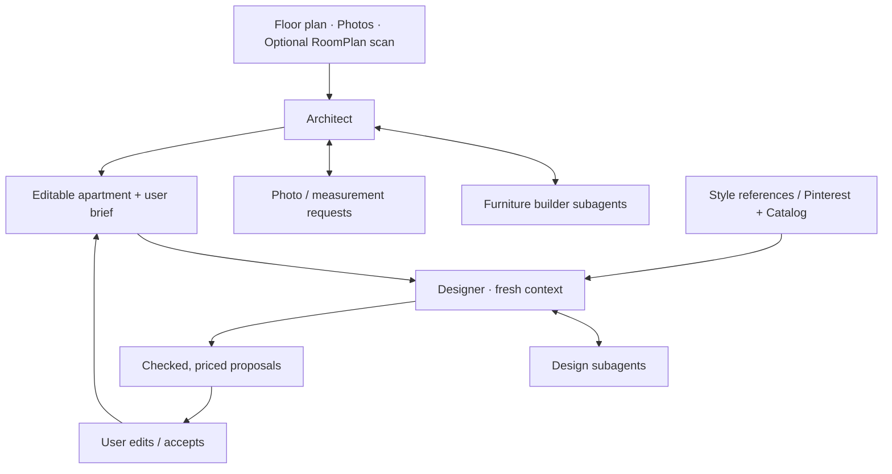

# Technical spec v0.0.0

*Discussion draft. Everything is open to change.*

## Agent flow



- **Architect:** builds the apartment, then idles. Returns for room corrections.
- **Builders:** recreate furniture in parallel; can ask for evidence and wait.
- **Designer:** ongoing design conversation; preserves belongings and constraints.
- **User:** can steer either agent while it works. Proposals need approval.

Plan-only supports unbuilt apartments. For existing rooms, the architect guides photo positions and combines requests from builders.

## Technical shape

| Part | Role |
| --- | --- |
| Codex SDK | Agent sessions + regular subagents |
| Scripts | Blender builds, renders, scene edits, fit checks, pricing |
| Skills | Build/design methods + lessons from our mistakes |
| Blender | Faithful assets from photos and editable starting scripts |
| Web app | 3D + plan editor, chat, progress, photo requests |
| Project files | Persistent scene, assets, references and drafts |

**Scene JSON owns:** geometry, object IDs, dimensions, attachments, evidence, estimates, user needs and catalog links.

Builders update assets without undoing newer placement edits. Manual edits feed back to the agents.

## Quality loop

```text
Build → Render → Compare with references → Fix
Design → Check fit + access + storage + budget → Preview → Accept
```

Benchmark furniture builds **with vs without starting scripts**. Measure likeness, time, usage and corrections. Test on held-back photos.

## Evals

- **Furniture:** use photos with known dimensions; hold back another angle. Compare builds with vs without starter scripts through blind human votes on likeness.
- **Rooms/layouts:** check dimensions, clipping, door access, storage needs and budget in code. Humans judge visual match and design quality.
- **Track:** time, token usage and manual corrections. Turn failures into test cases and skill updates; keep some examples unseen until the final check.

## First working demo

**Input → faithful editable room → live design request → checked layout + real prices**

Reuse saved runs during app development to conserve GPT-6 usage.

## Decide together

- Scene format, tool interfaces and team ownership
- Demo input paths and target fidelity
- Voice, RoomPlan and Pinterest integration scope
- Catalog access, quote-check scope and deployment
- Event rules on prior work
